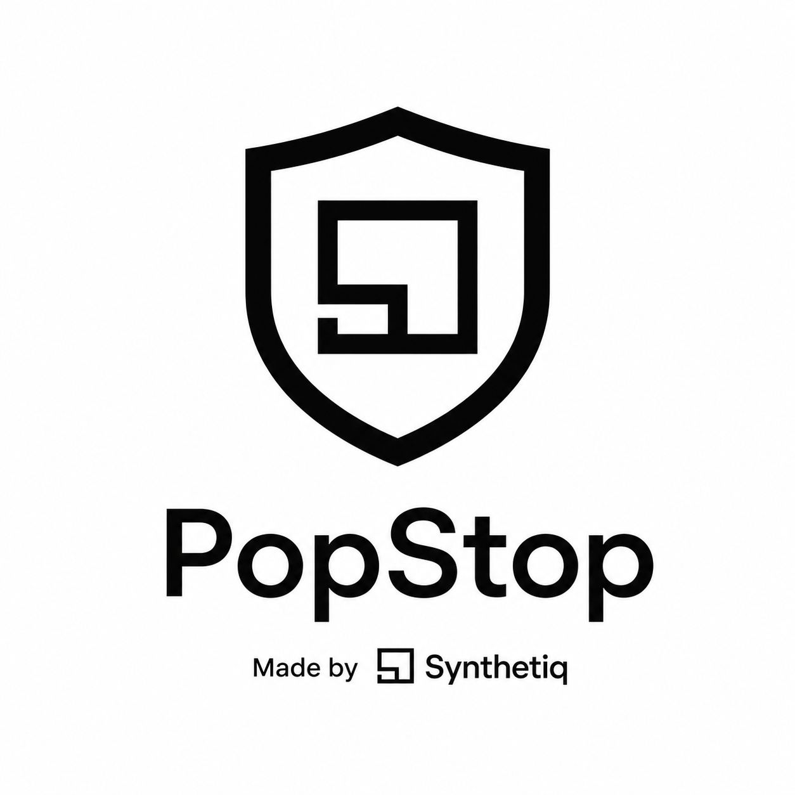

  

  <strong>The Popup Blackout for Your Browser.</strong> 
  Stop annoying popups, malicious redirects, and invisible click-trapping overlays. 
  Part of the <a href="https://github.com/Synthetiq-HQ">Synthetiq</a> toolkit — privacy-first, local-first, zero external dependencies.

  
  

---

## What It Is

**Synthetiq PopStop** is a behavior-based blocker that targets the part traditional ad blockers ignore: **malicious user-interaction traps**.

It watches your clicks, scores newly opened tabs for suspicious behavior, and shuts down popups, redirects, and invisible overlays before they ruin your browsing session.

### What It Blocks
- ✅ Unwanted popups & new-tab redirects
- ✅ Blank-tab-then-redirect tricks
- ✅ Invisible click-hijacking overlays
- ✅ Fake download buttons & fake play buttons
- ✅ Known ad network subresources (via DNR rules)
- ✅ Burst popups (multiple tabs opened at once)

### What It Does NOT Block
- ❌ Static banner ads on the page
- ❌ Sidebar ads or sponsored widgets
- ❌ YouTube / Netflix / TikTok ads (DRM-protected streams)
- ❌ Cookie consent banners

> **Think of it this way:** uBlock Origin hides the billboards. PopStop stops people from jumping in front of your car.

---

## Demo

https://github.com/user-attachments/assets/demo-placeholder

*(Replace with a 10-second screen recording of the popup blocking in action)*

---

## Features

| Feature | Description |
|---------|-------------|
| **Smart Scoring** | Every new tab gets a suspicion score based on timing, domain, URL patterns, and user intentionality |
| **Auto-Close** | Suspicious tabs close instantly — focus returns to your original page |
| **Toast Notifications** | See exactly which domain was blocked, bottom-right, non-intrusive |
| **Overlay Detection** | Finds invisible `pointer-events: auto` layers and safely disables them |
| **Shield Toggle** | Turn blocking on/off instantly from the toolbar popup |
| **Normal / Aggressive** | Two modes: Normal (score ≥ 40) or Aggressive (score ≥ 20) |
| **Per-Site Allowlist** | Never block sites you trust |
| **Video Detection** | Find direct video file URLs (.mp4, .webm) on supported sites |
| **Cloudflare Safe** | Never interferes with browser challenge pages |
| **Zero External Calls** | No servers, no analytics, no telemetry — everything is local |

---

## Installation

### From Source (Developer)

1. Download or clone this repo
2. Open Chrome → `chrome:///extensions`
3. Enable **Developer mode** (top-right toggle)
4. Click **Load unpacked**
5. Select the folder containing `manifest.json`

### From Chrome Web Store

*Coming soon.* See [`CHROME_STORE.md`](./CHROME_STORE.md) for the release checklist.

---

## How It Works

1. **Click Tracking** — The content script records your click (timestamp, coordinates, element type, modifiers) and sends it to the background worker.
2. **Session Window** — A 2-second window keeps your click session in memory.
3. **Tab Scoring** — When a new tab opens, the classifier scores it: timing, domain difference, known bad domains, burst detection, URL patterns.
4. **Action** — If the score exceeds the threshold, the tab is closed, focus returns, stats update, and a toast appears.
5. **Overlay Guard** — On every click, `elementsFromPoint()` scans for invisible fixed/absolute layers and disables them safely.

---

## Architecture

| File | Role |
|------|------|
| `manifest.json` | Manifest V3 config, permissions, DNR rules |
| `background.js` | Service worker — tab monitoring, classification, stats, downloads |
| `classifier.js` | Shared scoring logic (ES module) |
| `content.js` | Content script — click tracking, toast, overlay detection |
| `injected.js` | Page-context script — overlay disabling, media detection |
| `popup.html/css/js` | Browser action popup — shield, mode, stats, allowlist, video list |
| `options.html/css/js` | Full settings page — dashboard, allowlist, activity log, import/export |
| `rules.json` | Static DNR rules for known ad/popup domains |

---

## Local Testing

Open any of the test files in Chrome and follow the instructions:

| File | What It Tests |
|------|---------------|
| `test0.html` | Baseline — verify `window.open` works |
| `test1.html` | Suspicious popup to `popads.net` |
| `test2.html` | Normal trusted link (should stay open) |
| `test3.html` | Invisible overlay click trap |
| `test4.html` | Shield OFF toggle |
| `test5.html` | Per-site allowlist |
| `test-canyoublockit.html` | Full simulation of canyoublockit.com tests |

---

## Suspicion Scoring

| Factor | Score |
|--------|-------|
| Opens within 2s of click | +30 |
| Opener tab matches click tab | +20 |
| Different domain from source | +20 |
| Known suspicious domain | +25 |
| Multiple tabs in short window | +15 |
| Click not on interactive element | +15 |
| Blank URL (script redirect) | +10 |
| URL matches popup/ad pattern | +10 |
| Ctrl/Meta-click or middle-click | −50 |
| Same domain | −50 |
| Trusted domain | −30 |
| Site allowlisted | −100 |
| Shield disabled | −100 |
| Cloudflare challenge page | −200 |

**Threshold:** `≥ 40` (Normal) / `≥ 20` (Aggressive)

---

## Video Downloads

PopStop can detect **direct video file URLs** (`.mp4`, `.webm`, etc.) on sites that serve them openly.

**Protected streaming platforms are NOT supported:** YouTube, Netflix, TikTok, Instagram, Facebook, and others use DRM + authenticated streams that browser extensions cannot bypass. For those sites, PopStop shows a **Protected** badge and lets you copy the URL.

---

## Privacy

- **No data leaves your browser.**
- **No analytics, telemetry, or remote servers.**
- All settings and stats stored in `chrome.storage.local` only.
- Open source — inspect every line of code.

See the full [Privacy Policy](./PRIVACY_POLICY.md).

---

## Chrome Web Store

Ready to publish? See [`CHROME_STORE.md`](./CHROME_STORE.md) for:
- Store listing copy (title, description, keywords)
- Screenshot guidelines
- Compliance checklist
- Rejection troubleshooting
- LinkedIn post template

---

## Roadmap

- [ ] EasyList filter integration (experimental)
- [ ] Per-site custom rules UI
- [ ] Dark mode for popup & settings
- [ ] Firefox / Edge port

---

## License

MIT — use at your own risk.

---

Built with 💜 by [Synthetiq](https://github.com/Synthetiq-HQ).
